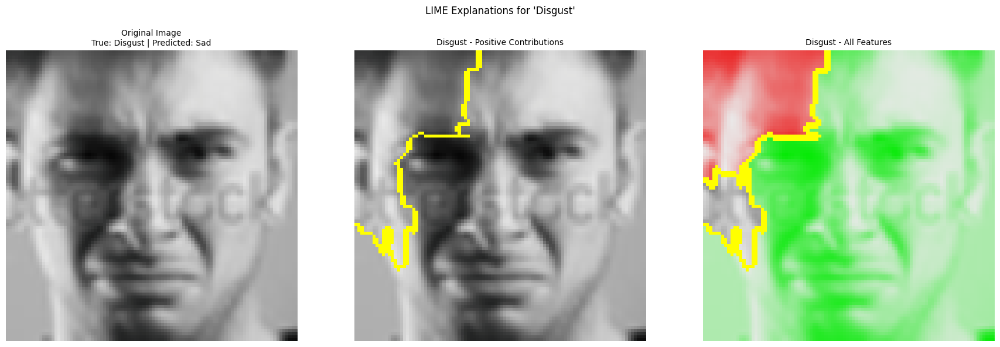

# Facial Expression Recognition (FER2013)

This project focuses on solving a multi-class facial expression recognition problem using the FER2013 dataset. Through transfer learning, sampling strategies, face alignment, and explainable AI techniques, a robust and real-time expression recognition system has been developed.

## Contents

- [Dataset and Class Imbalance](#dataset-and-class-imbalance)
- [Sampling Strategies](#sampling-strategies)
- [Model Architectures](#model-architectures)
- [Face Alignment](#face-alignment)
- [Explainability with LIME](#explainability-with-lime)
- [Model Comparisons](#model-comparisons)
- [Real-Time Application](#real-time-application)

---

## Dataset and Class Imbalance

The FER2013 dataset contains 48x48 grayscale facial images labeled across 7 emotion classes: Angry, Disgust, Fear, Happy, Sad, Surprise, and Neutral.

  
*Sample images from FER2013.*

The original dataset is highly imbalanced.

  
*Original label distribution showing class imbalance.*

---

## Sampling Strategies

To address the imbalance, three sampling strategies were applied:

### Undersampling and Oversampling:

  
*Class distribution after applying undersampling and oversampling.*

### Hybrid Sampling (Target = 8989):

  
*Balanced class distribution using hybrid sampling.*

---

## Model Architectures

Four transfer learning-based CNN architectures were fine-tuned:

- XceptionNet (best performing)
- MobileNet-V3-Large-100
- EfficientNet-B0
- ResNet-18

Each model was evaluated using Precision, Accuracy, Recall, and F1 Score.

---

## Face Alignment

Face alignment was applied using MTCNN (Multi-task Cascaded Convolutional Networks), improving model focus and performance.

| Without Alignment | With Alignment |
|-------------------|----------------|
|  |  |

---

## Explainability with LIME

LIME (Local Interpretable Model-Agnostic Explanations) was used to visualize model attention.

### Before Alignment:

- 
- 
- 

### After Alignment:

- 
- 
- 

---

## Model Performance Comparison

The following figures illustrate class-wise metrics before and after alignment for the XceptionNet model:

| Before Alignment | After Alignment |
|------------------|-----------------|
|  |  |

---

## Real-Time Application

The final models were exported to ONNX format and deployed in a real-time facial expression recognition system.

**Pipeline:**

1. Face detection via MTCNN.
2. 96x96 RGB face crops fed to ONNX model.
3. Predicted emotion displayed on screen.
4. Achieves high FPS and low latency performance.

---

## Conclusion

### Key Takeaways:

- Sampling strategies and custom loss functions help mitigate class imbalance.
- Face alignment significantly improves model accuracy and reliability.
- ONNX conversion and simplification enable real-time applications.
- LIME visualizations aid in interpreting model behavior and misclassifications.

### Limitations:

- FER2013 is grayscale and low-resolution, limiting fine-grained feature learning.
- Extremely low sample count in classes like *Disgust* still causes occasional misclassifications.
- Real-world deployment requires more diverse and high-resolution datasets.

---

## External Links

- [FER2013 Dataset on Kaggle](https://www.kaggle.com/c/challenges-in-representation-learning-facial-expression-recognition-challenge)

